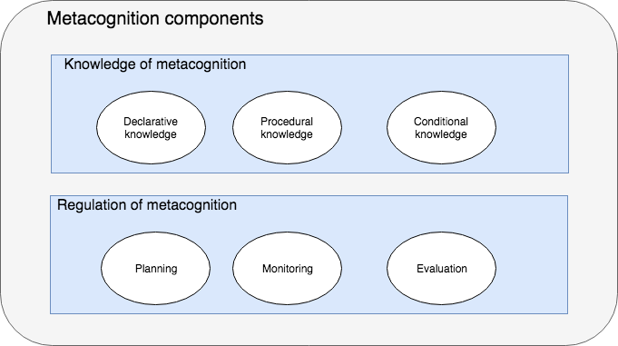

#Introduction to metacognition
##What is metacognition?
The simplest definition of Metacognition is that it is “thinking about thinking”. It is the knowledge you have of your own cognitive processes (your thinking) and It is your ability to control your cognitive processes using various techniques, such as organizing, monitoring, and adapting. Additionally, it is the ability to reflect upon the tasks or processes you perform and to select and utilize the appropriate techniques necessary in your intercultural interactions. So if a software engineer's cognitive skills are the skills that help him perform a task (code, test, etc), metacognitive skills are those that help the engineer monitor and regulative his cognitive performance. 

Metacognition is considered a key component for successful learning. It involves self-regulation and self-reflection of strengths, weaknesses, and the types of strategies you create. It is a necessary foundation in culturally intelligent leadership because it underlines how you think through a problem or situation and the strategies you create to address the situation or problem.

##Components of metacognition
Most theories of metacognition divide it into two major components, they are: 

### Knowledge of metacognition 
This tries to answer the question: What do I know about my own cognitive system? How does it work? What helps it perform better and what makes it perform worse? Generally the knowledge of metacognition is split into three sub components:
#### Declarative knowledge
Knowing myself as a learner and knowing my limits, for example many engineers knows the limits of their own memory system, how much they can remember and how much will slip away. 
#### Procedural knowledge
Knowing about the procedures and strategies that help me overcome my shortcomings. These shortcomings that I probably knew from the declarative knowledge of my cognitive abilities, like for example using note taking with a pen and paper if I know that my memory does not recall important points. 
#### Conditional knowledge
Knowing which procedure or which strategy works when, and selecting the appropriate strategy for each situation to achieve the best results. 
### Regulation of metacognition 
So now I know about my own cognition and how it behaves from the knowledge of metacognition component, it is time to try to use this knowledge to improve my performance and my cognitive techniques, this usually happens on three major activities:
#### Planning
The process of selecting the appropriate strategies and allocating the resources needed to execute these strategies. It also involves setting goals and deciding what you want to achieve in this phase. 
#### Monitoring
After you have your plan set, you start executing it, and during execution you monitor how the selected strategies affected your cognitive performance.
#### Evaluation
After executing the plan and collecting observations from monitoring, you start reflecting on the collected data, and decide which processes and strategies was a good match to the situation, and which was not. 
